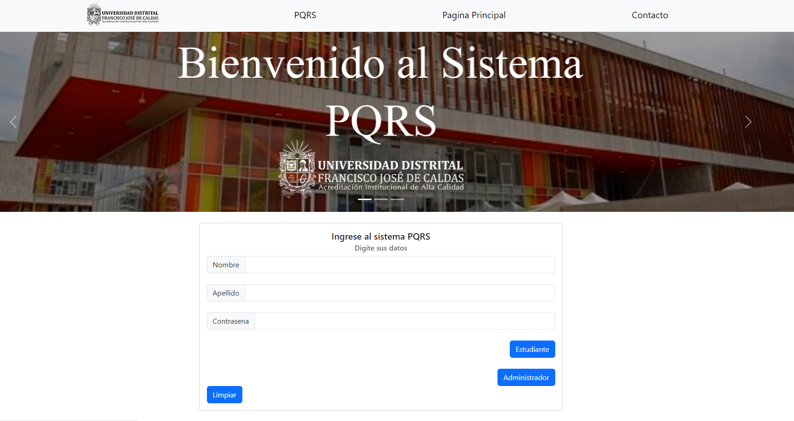

# PQRS-Web-System
This was my final project for the advanced programming subject where we had to make a system to respond to queries on the web.

## Techonolgies
In this project use HTML, CSS, and JavaScript and PHP, and use a XAMPP Database MySQL

